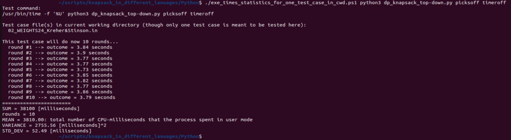
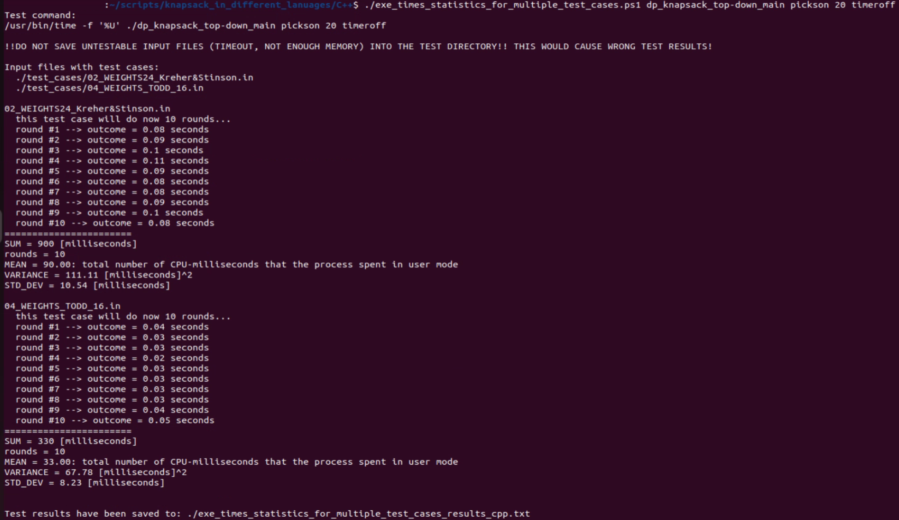

2023-11-03: _exe_times_statistics_for_multiple_test_cases.ps1_ (mass testing script) done; this README.md updated

### PowerShell scripts

ps = PowerShell

Now floating point arithmetic is supported!

#### Install PowerShell in Linux

This worked for me in Ubuntu 22 LTS:

2023: Getting Started with PowerShell in Linux [Beginner Guide]: https://www.tecmint.com/install-powershell-in-linux/

```
$ sudo apt-get install -y wget apt-transport-https software-properties-common
$ wget -q "https://packages.microsoft.com/config/ubuntu/$(lsb_release -rs)/packages-microsoft-prod.deb"
$ sudo dpkg -i packages-microsoft-prod.deb
$ sudo apt-get update
$ sudo apt-get install -y powershell
```

**Before running a ps script make it executable:**
```
$ chmod 755 ./exe_times_statistics_for_one_test_case_in_cwd.ps1
$ chmod 755 ./exe_times_statistics_for_multiple_test_cases.ps1

```

Put this statement into the first line of a ps script:

```
#!/usr/bin/pwsh -Command
```

<br/>

#### (a) exe_times_statistics_for_one_test_case_in_cwd.ps1

https://github.com/PLC-Programmer/0-1_knapsack_DP_top-down_diff_lang/blob/main/PowerShell_scripts_mass_testing/exe_times_statistics_for_one_test_case_in_cwd.ps1

This script is **only useful with having only one test case file** (*.in) in the cwd (current working directory) or relevant directory, respectively of the to be tested program. Shell commands for testing the program in (here only for _pickson_, otherwise take _picksoff_ for example):

* Python: _$ ./exe_times_statistics_for_one_test_case_in_cwd.ps1 python3 dp_knapsack_top-down.py pickson timeroff_
* C++: _$ ./exe_times_statistics_for_one_test_case_in_cwd.ps1 dp_knapsack_top-down_main pickson **20** timeroff_
* C#: _$ ./exe_times_statistics_for_one_test_case_in_cwd.ps1 ./bin/Release/net7.0/linux-x64/dp_knapsack_top-down pickson timeroff_
* Rust: _$ ./exe_times_statistics_for_one_test_case_in_cwd.ps1 ./target/release/dp_knapsack_top-down pickson timeroff_

Example output for a Python test case:




### Shut the internal execution timer off

Also use these scripts **only** with the activated option to bypass the internal execution timer of the to be tested program: [no_timer, notimer, timer_off, timeroff].
Then also provide a [pickson, picksoff] option before ([no_picks, nopicks, picks_off, picksoff]), for example:

_$ python3 ./dp_knapsack_top-down.py pickson timeroff_

I haven't provided elaborated user arguments evaluation for my programs.

 
### Linux time command

These scripts use the Linux _time_ command, here for the C++ program for example:

_$ /usr/bin/time -f '%U' ./dp_knapsack_top-down_main pickson 20 timeroff_

(*) see: https://www.man7.org/linux/man-pages/man1/time.1.html

This seemingly odd mechanism of these scripts leave the computer programs in the different programming languages almost untouched.
                                          
However, I had to add the option (as a second or third user argument, respectively) to not use the internal execution timer: [no_timer, notimer, timer_off, timeroff]

<br/>

#### (b) exe_times_statistics_for_multiple_test_cases.ps1

https://github.com/PLC-Programmer/0-1_knapsack_DP_top-down_diff_lang/blob/main/PowerShell_scripts_mass_testing/exe_times_statistics_for_multiple_test_cases.ps1

This script takes all test case files (*.in) from directory _./test_cases_ and copies them one by one into the cwd or relevant directory, respectively, of the to be tested program. Shell commands for testing the program in (here only for _pickson_, otherwise take _picksoff_ for example):


* Python: _$ ./exe_times_statistics_for_multiple_test_cases.ps1 python3 dp_knapsack_top-down.py pickson timeroff_
* C++: _$ ./exe_times_statistics_for_multiple_test_cases.ps1 dp_knapsack_top-down_main pickson 20 timeroff_
* C#: _$ ./exe_times_statistics_for_multiple_test_cases.ps1 ./bin/Release/net7.0/linux-x64/dp_knapsack_top-down pickson timeroff_
* Rust: _$ ./exe_times_statistics_for_multiple_test_cases.ps1 ./target/release/dp_knapsack_top-down pickson timeroff_

This script will produce a log file _exe_times_statistics_for_multiple_test_cases_results_<language_id>.txt_ with some simple test statistics like mean execution time, variance and standard deviation for the test cases in _./test_cases_.

Depending on the underlying command, this scripts makes a guess of the original programming language in use, so far:

* _python
* _cpp
* _cs
* _rust

..for example: _exe_times_statistics_for_multiple_test_cases_results_cpp.txt_, in order to not accidentally overwrite an older test result file from another language when saving different test result files into a common directory.

> **Warning**
DO NOT SAVE UNTESTABLE INPUT FILES (TIMEOUT, NOT ENOUGH MEMORY) INTO THE TEST DIRECTORY! THIS WOULD CAUSE WRONG TEST RESULTS!

So preselect your test cases files when mass testing.

Example output for two C++ test cases:



<br/>


### Keep script outputs simple

Of course, these test scripts could have been implemented in a much more sophisticated way, be it in Python or PowerShell, to produce test results files (in JSON/JavaScript object notation for example), which then can be read with Python programs for the diagramming jobs for example: https://github.com/PLC-Programmer/0-1_knapsack_DP_top-down_diff_lang/tree/main/DataDraw_diagrams_Python

However, I decided against this effort. Producing only simple, unstructured, text-based test result files provides flexibility for the (sub-)selection of test cases, specifically when doing mass testing.

Writing code to stitch together all kind of individual test result files to prepare them for further processing like diagramming may lead to further confusion of the user. It would also be a coding task way out of the scope of this endeavor, which should focus on comparing the execution speeds of different computer programming languages for the same computational task.

Anyway, there are still other imperfections present like a precision of only +/-10 milliseconds from the used Linux _time_ command.

##_end
