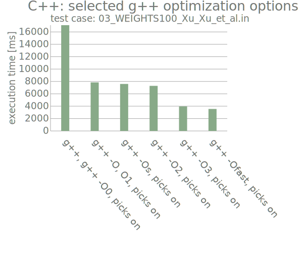

# The 0/1 knapsack problem with dynamic programming with the top-down (recursive) algorithm: comparing execution speeds of programming languages

2023-09-19/20/22...: a work in progress (WIP)

First batch of programming languages:
* **Python**: albeit slow, if possible this is my reference for calculating a correct result for an unknown test case
* **C++** (with the _g++ -O3_ optimization option; gcc version 11.4.0 has been used here)
* **C#** (release build)
* **Rust** (release build)

DP = Dynamic Programming

Important things first (with Python included see below at https://github.com/PLC-Programmer/0-1_knapsack_DP_top-down_diff_lang#diagrams-of-the-individual-programming-languages ):

 
This project is a spin-off from this project: https://github.com/PLC-Programmer/knapsack_Axiotis-Tzamos, where only Algo 3 is used here: https://github.com/PLC-Programmer/knapsack_Axiotis-Tzamos#algo-3----15-winner-dp-top-down 
  

## The odd case of the implementation with C++

While C++ is looking good in above diagram, and as many would expect, this test case, which is very different in nature, might come as a shock even:

Also with this test case, C++ is also not looking so good with an activated picks table (for backtracking the optimal result if desired):

In the C++ program I use the **vector data type** for the **picks table** in the recursive function, however in Rust I do the same.

(In the C# program I use the array data type.)

(One might guess that also using the good old array data type might lead to a faster C++ program with some of the test cases.)

## Diagrams of the individual programming languages

Since the other test cases can be computed much faster (if possible in my environment) than test case _03_WEIGHTS100_Xu_Xu_et_al.in_:

...this test case is omitted from these diagrams:

<rev.2023-09-22, C++: mass tested with script: 10 rounds for each test case, arithmetic mean, using Linux time command; g++ -O3 compiled>

## Environment

Hardware:

* CPU: Intel Core i7-11700K, 3.60GHz (11th gen.)

* mainboard: GigaByte Z590 GAMING X, rev.0

* RAM: DDR4, 16GB, 3200-16 Vengeance LPX

Operating system:

* _$ uname -a_ --> _Linux ... 6.2.0-32-generic #32~22.04.1-Ubuntu SMP PREEMPT_DYNAMIC Fri Aug 18 10:40:13 UTC 2 x86_64 x86_64 x86_64_

### Used compiler or builder version, respectively

* **Python**: _$ python3 -V -V_ --> _Python 3.10.12 (main, Jun 11 2023, 05:26:28) [GCC 11.4.0]_

* **C++**: _$ g++ --version_ --> _g++ (Ubuntu 11.4.0-1ubuntu1~22.04) 11.4.0_

* **C#**:

  _$ dotnet --list-sdks_ --> _7.0.111 [/usr/lib/dotnet/sdk]_

  _$ dotnet --list-runtimes_ -->

    _Microsoft.AspNetCore.App 7.0.11 [/usr/lib/dotnet/shared/Microsoft.AspNetCore.App]_

    _Microsoft.NETCore.App 7.0.11 [/usr/lib/dotnet/shared/Microsoft.NETCore.App]_

* **Rust**:

  _$ cargo -V_ --> _cargo 1.66.1_

  _$ rustc -V_ --> _rustc 1.66.1 (90743e729 2023-01-10) (built from a source tarball)_

## C++: g++ compiler options for speed optimization

Apparently the choice of options for (speed) optimization has a huge influence on the performance of a compiled C++ program with g++: https://gcc.gnu.org/onlinedocs/gcc-11.4.0/gcc/Optimize-Options.html

Well, at least with the presented computational task here.

Compile the C++ source code with command: _$ g++ [options] ./dp_knapsack_top-down_main.cpp -o dp_knapsack_top-down_main_

I experimented with these optimization options on test case _03_WEIGHTS100_Xu_Xu_et_al.in_:

* -O0 (or no -O option) -- Reduce compilation time and make debugging produce the expected results. This is the default.

* -O, -O1 -- Optimize.

* -O2 -- Optimize even more.

* -O3 -- Optimize yet more  // this option has been used for all C++ results presented here; option -Ofast looks a little bit faster here; however I guess I should keep _strict standards compliance_ for now

* -Os -- Optimize for size.

* -Ofast -- Disregard strict standards compliance.

 
## Case testing for execution times

So far I have implemented three simple options:

(a) running with internal timers (inside source code):

...(examples how to run programs)

This option is probably not really useful for meaningful test statistics.

Concepts differ from one programming language to the other, at least with my implementations. However, it's useful in my opinion to compare one test case with another **processed with a program written in the same programming language**. This is why this is the original timing implementation and will stay as a feature: https://github.com/PLC-Programmer/knapsack_Axiotis-Tzamos

\
(b) bash script for **one individual test case** file (*.in) in the current working directory (cwd):  _exe_times_statistics_for_one_test_case_in_cwd_

...(examples how to run programs)

Also see: https://github.com/PLC-Programmer/0-1_knapsack_DP_top-down_diff_lang/blob/main/bash_shell_scripts_mass_testing/readme.txt

\
(c) bash script for **mass testing** of test cases (*.in) saved in directory _./test_cases_:  _exe_times_statistics_for_multiple_test_cases_

...(examples how to run programs)
