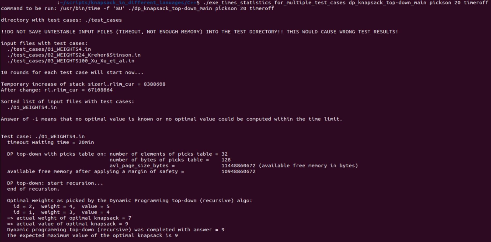

2023-11-03: I added two complementary PowerShell scripts: https://github.com/PLC-Programmer/0-1_knapsack_DP_top-down_diff_lang/tree/main/PowerShell_scripts_mass_testing  However, I will leave these bash shell scripts here (in case you can't or don't want to use PowerShell scripts in Linux). 

### bash shell scripts

Here are two scripts for mass testing for the execution times (here the "Total number of CPU-seconds that the process spent in user mode" (*)) for the programs in the different programming languages (Python, C++, C#, Rust, ...).

Check Linux mode (755) to make these scripts executable.

\
(a) *_exe_times_statistics_for_one_test_case_in_cwd_* (755)

This script is **only useful with having only one test case file** (*.in) in the cwd (current working directory) or relevant directory, respectively of the to be tested program. Shell commands for testing the program in (here only for _pickson_, otherwise take _picksoff_ for example):

* Python: _$ ./exe_times_statistics_for_one_test_case_in_cwd python3 dp_knapsack_top-down.py pickson timeroff_
* C++: _$ ./exe_times_statistics_for_one_test_case_in_cwd dp_knapsack_top-down_main pickson **20** timeroff_
* C#: _./exe_times_statistics_for_one_test_case_in_cwd ./bin/Release/net7.0/linux-x64/dp_knapsack_top-down pickson timeroff_
* Rust: _./exe_times_statistics_for_one_test_case_in_cwd ./target/release/dp_knapsack_top-down pickson timeroff_

\
(b) *_exe_times_statistics_for_multiple_test_cases_* (755)

This script takes all test case files (*.in) from directory _./test_cases_ and copies them one by one into the cwd or relevant directory, respectively, of the to be tested program. Shell commands for testing the program in (here only for _pickson_, otherwise take _picksoff_ for example):

* Python: _$ ./exe_times_statistics_for_multiple_test_cases python3 dp_knapsack_top-down.py pickson timeroff_
* C++: _$ ./exe_times_statistics_for_multiple_test_cases dp_knapsack_top-down_main pickson **20** timeroff_
* C#: _$ ./exe_times_statistics_for_multiple_test_cases ./bin/Release/net7.0/linux-x64/dp_knapsack_top-down pickson timeroff_
* Rust: _$ ./exe_times_statistics_for_multiple_test_cases ./target/release/dp_knapsack_top-down pickson timeroff_

This script will produce a log file (_exe_times_statistics_for_multiple_test_cases_results.txt_) with simple test statistics.

> **Warning**
DO NOT SAVE UNTESTABLE INPUT FILES (TIMEOUT, NOT ENOUGH MEMORY) INTO THE TEST DIRECTORY! THIS WOULD CAUSE WRONG TEST RESULTS!

So preselect your test cases files when mass testing.

Beginning of an example output for C++ test cases:

 
### Shut the internal execution timer off

Also use these scripts **only** with the activated option to bypass the internal execution timer of the to be tested program: [no_timer, notimer, timer_off, timeroff].
Then also provide a [pickson, picksoff] option before ([no_picks, nopicks, picks_off, picksoff]), for example:

_$ python3 ./dp_knapsack_top-down.py pickson timeroff_

I haven't provided elaborated user arguments evaluation for my programs.

 
### Linux time command

These scripts use the Linux _time_ command, here for the C++ program for example:

_$ /usr/bin/time -f '%U' ./dp_knapsack_top-down_main pickson 20 timeroff_

(*) see: https://www.man7.org/linux/man-pages/man1/time.1.html

This seemingly odd mechanism of these scripts leave the computer programs in the different programming languages almost untouched.
                                          
However, I had to add the option (as a second or third user argument, respectively) to not use the internal execution timer: [no_timer, notimer, timer_off, timeroff]

### Keep script outputs simple

See from here: https://github.com/PLC-Programmer/0-1_knapsack_DP_top-down_diff_lang/tree/main/PowerShell_scripts_mass_testing#keep-script-outputs-simple

##_end
